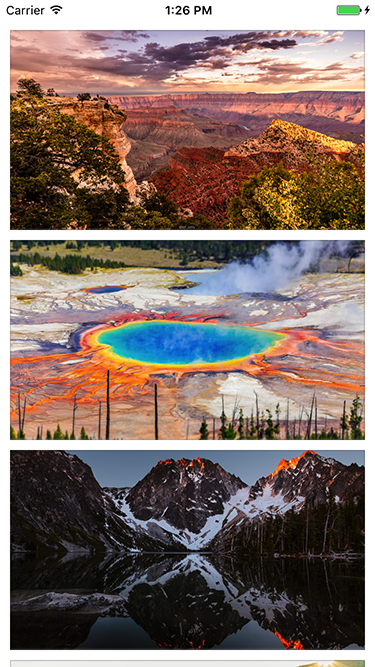
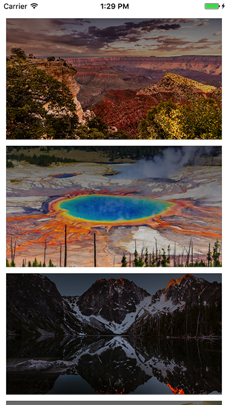
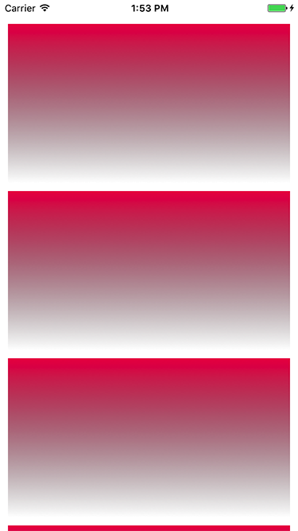

[](https://travis-ci.org/YapImageManager/YapImageManager)
[](https://img.shields.io/cocoapods/v/YapImageManager.svg)
[](http://cocoadocs.org/docsets/YapImageManager)
[](http://twitter.com/yapstudios)

## Features
- [x] Asynchronous image downloader with priority queuing
- [x] Advanced memory and database caching using [YapDatabase](https://github.com/yapstudios/YapDatabase) (SQLite)
- [x] Guarantee of only one image download per request
- [x] Cancellation of pending requests with ticket
- [x] Background image decoding, resizing and filtering
- [x] Custom image filters
- [x] Image rendering of gradients and more using filters
- [x] High performance scrolling
- [x] Automatic pause and resume of download queue on reachability changes
- [x] Written completely in Swift

## Roadmap Features
- [x] Ability to capture image height and width from the raw decoded image data stream, **before the image is downloaded** via a notification, for gif, png, and jpeg formats. This is extrememly useful for displaying full width images with the proper aspect ratio in a table view or collection view, by enabling you to calculate the cell height and update the layout almost immediately while the visible images are downloading.
- [x] Ability to return an image with the first frame of a GIF before the entire GIF is downloaded.
- [x] Ability to convert GIFs to MP4 files for better memory managment and scrolling performance


## Requirements

- iOS 10.0+ / tvOS 9.0+
- Xcode 8.0+
- Swift 3.0+

## Installation

### CocoaPods

YapImageManager supports [CocoaPods](http://cocoapods.org) for easy installation. Below is a sample podfile.

```
source 'https://github.com/CocoaPods/Specs.git'
platform :ios, '9.0'
use_frameworks!

target '<Your Target Name>' do
    pod 'YapImageManager', '~> 1.0.2'
end

```

## Usage

### Requesting a full-sized image
Below is an example of how to request a full-sized, decoded image and set the image response on a `UIImageView`.

```
  YapImageManager.sharedInstance.asyncImage(forURLString: URLString) { [weak self] response in
    if let image = response.image {
      self?.imageView.image = image
    }
  }
```

### Requesting an image of a specific maximum size
Below is an example of how to fetch a decoded image of a specific size and set the image response on a `UIImageView`. Requesting an image size that matches the bounds of your `UIImageView` can increase scrolling performance but avoiding a resize on the GPU. Decoded and sized images are cached in memory, reducing CPU time.

```
  YapImageManager.sharedInstance.asyncImage(forURLString: URLString, size: self.bounds.size) { [weak self] response in
    if let image = response.image {
      self?.imageView.image = image
    }
  }
```

### Requesting an image with a ticket for cancellation
Requesting an image with a ticket is important for use in a `UITableView` or `UICollectionView` with recycling cells. When a cell is recycled, cancelling the ticket ensures that a prior image request will not complete and update the image of a new cell with a different image request. It also will improve performance by cancelling any unneeded download requests for cells that are no longer visible during fast scrolling. Below is an example.

Add the `ticket` member variable to your class...

```
private var ticket: ImageRequestTicket?
```

Request the image, saving the ticket...

```
  ticket = YapImageManager.sharedInstance.asyncImage(forURLString: URLString, size: self.bounds.size) { [weak self] response in
    
    if response.ticket == self?.ticket {
      self?.ticket = nil
      
      if let image = response.image {
        self?.imageView.image = image
      }
    }
  }
```

In `prepareForReuse`, cancel the ticket...

```
  override func prepareForReuse() {
    super.prepareForReuse()
    
    if let ticket = self.ticket {
      YapImageManager.sharedInstance.cancelImageRequest(forTicket: ticket)
      self.ticket = nil
    }
  }
```

Below is the example output.



### Requesting an image with filters

To render an image with one or more image filters, simply pass an array of `YapImageFilter` in the request. YapImageManager has the following built-in filters:

- `YapAspectFillFilter` - draws the original image with content mode aspect fill
- `YapGradientFilter` - draws a gradient from a specified `startColor` to `endColor`
- `YapColorFilter` - draws a background color, or overlay color, depending on whether you include before or after `YapAspectFillFilter`
- `YapOverlayImageFilter` - draws a custom `UIImage` specified by `overlayImage`

You can create your own custom filters by adopting the protocol `YapImageFilter`. 

Below is an example of adding a gradient overlay to an image. When using filters, be sure at least one filter renders the original image, for example using `YapAspectFillFilter`.

```
  let filters: [YapImageFilter] = [YapAspectFillFilter(), YapGradientFilter(startColor: .clear, endColor: UIColor.black.withAlphaComponent(0.5))]
  YapImageManager.sharedInstance.asyncImage(forURLString: URLString, size: self.bounds.size, filters: filters) { [weak self] response in
    if let image = response.image {
      self?.imageView.image = image
    }
  }
```

Below is the example output.



### To render a new image, for example a gradient

To render a new image using filters, use the `createImage` method passing in the desired size and an array of `YapImageFilter`. The following example generates a simple overlay gradient.

```
  let gradient = YapGradientFilter(startColor: .clear, endColor: UIColor.black.withAlphaComponent(0.8))    
  YapImageManager.sharedInstance.createImage(withSize: self.bounds.size, filters: [gradient]) { [weak self] image in
    self?.imageView.image = image
  }
```

Below is the example output.



## Credits

YapImageManager is owned and maintained by [Yap Studios](http://www.yapstudios.com).


